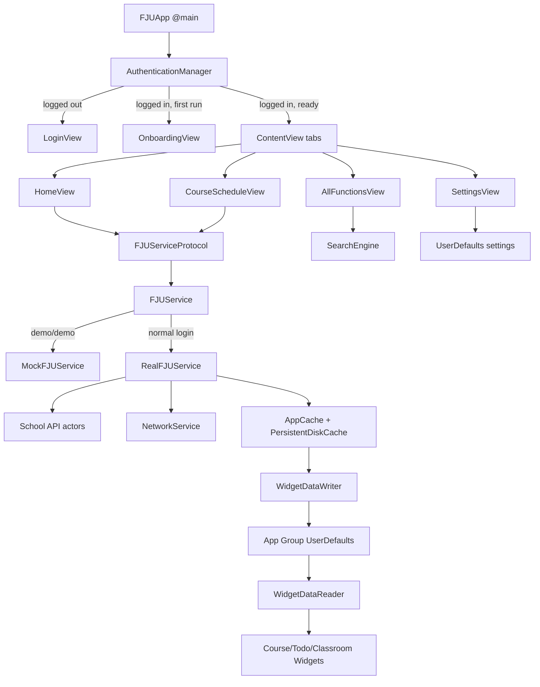
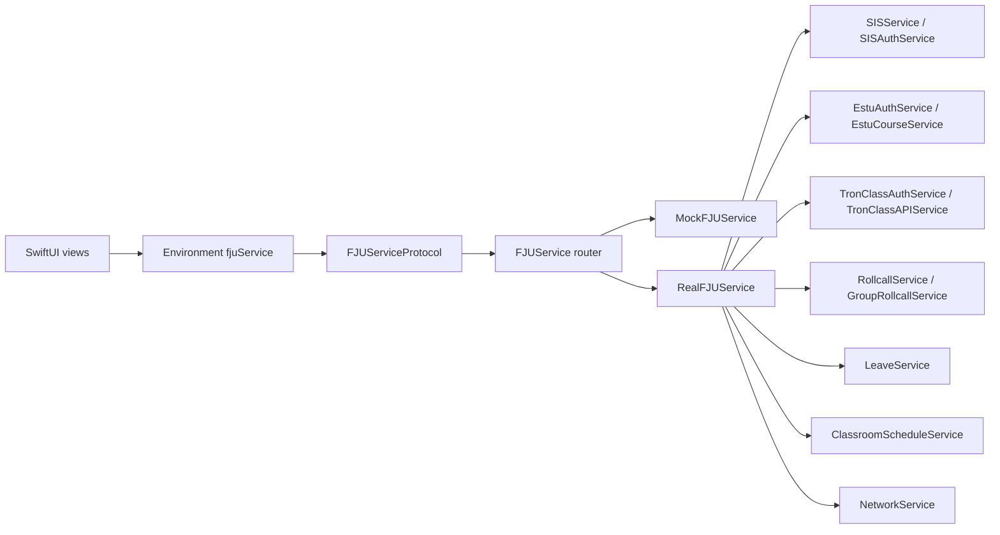
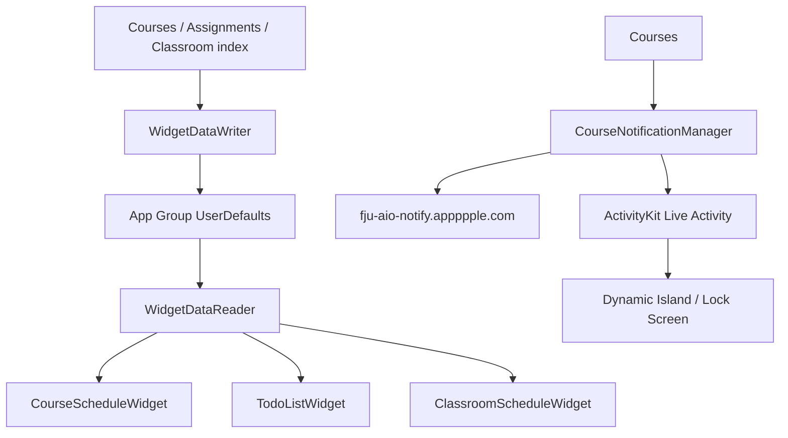

# FJU AIO Project Map

This project is a SwiftUI iOS app for Fu Jen Catholic University students. It combines academic data, campus tools, social schedule sharing, widgets, Live Activities, EventKit sync, and school/web system integrations.

## Targets

```text
fju-aio.xcodeproj
|- fju-aio                         Main iOS app
|  |- Bundle ID: com.nelsongx.apps.fju-aio
|  |- Deployment target: iOS 17.2
|  |- Entry point: fju-aio/Views/FJUApp.swift
|  |- URL scheme: fju-aio://page/...
|  `- Entitlements: CloudKit, app group, development push
`- CourseWidget                    Widget extension
   |- Bundle ID: com.nelsongx.apps.fju-aio.CourseWidget
   |- Deployment target: iOS 26.2
   |- Entry point: CourseWidget/CourseWidgetBundle.swift
   `- Entitlements: app group
```

Shared data between the app and widgets uses the app group:

```text
group.com.nelsongx.apps.fju-aio
```

## High-Level Architecture



## Runtime Flow

The real app starts in `FJUApp`.

```text
FJUApp
|- creates AuthenticationManager
|- refreshes iCloud availability
|- checks existing TronClass/SIS sessions
|- shows one of:
|  |- LaunchScreenView while auth/preload/logout is running
|  |- LoginView when unauthenticated
|  |- OnboardingView before first completed setup
|  `- ContentView for the main app
`- handles fju-aio:// deep links and widget quick launches
```

On successful login, `AuthenticationManager` logs into TronClass and SIS in parallel. It also establishes CloudKit profile identity, imports cloud friends, and marks the app authenticated. Demo credentials (`demo` / `demo`) switch `FJUService` into mock mode.

During splash preload, `FJUApp` tries to fetch:

```text
available semesters
`- current semester courses
   |- cache courses/events in AppCache
   |- write course payloads for widgets
   |- schedule course Live Activities remotely
   `- optionally sync calendar/todo data into EventKit
```

## Navigation

`ContentView` owns the main tab layout and navigation stacks.

```text
TabView
|- Home
|  `- NavigationStack(homePath)
|- Course Schedule
|  `- NavigationStack(courseSchedulePath)
|- All Functions
|  `- NavigationStack(allFunctionsPath)
`- Settings
   `- NavigationStack
```

Routes are modeled by `AppDestination` in `ContentView.swift`. Deep links use this shape:

```text
fju-aio://page/courseSchedule
fju-aio://page/course?courseId=<id>
fju-aio://page/campusMap?location=<room-or-building>
```

All deep links currently open through the Home navigation stack.

## Main Feature Areas

### Home

Files:

```text
fju-aio/Views/Home/HomeView.swift
fju-aio/Views/Home/HomeEditView.swift
fju-aio/Models/HomePreferences.swift
```

Home shows greeting/date, today's courses, selected modules, and TronClass bulletin notifications. It prefers cached semester/course data first, then refreshes from `FJUService`. Course loads also refresh widget data and schedule Live Activities.

### Course Schedule

Files:

```text
fju-aio/Views/CourseSchedule/CourseScheduleView.swift
fju-aio/Views/CourseSchedule/CourseDetailSheet.swift
fju-aio/Views/CourseSchedule/CourseCell.swift
fju-aio/Models/Course.swift
```

The schedule view loads available semesters, then courses for the selected semester. It renders a weekday/period grid, supports deep-linked course details, can jump to campus map by course location, and overlays friend schedule snapshots from `FriendStore`.

### All Functions and Search

Files:

```text
fju-aio/Views/AllFunctions/AllFunctionsView.swift
fju-aio/Views/AllFunctions/SearchResultsView.swift
fju-aio/Models/ModuleRegistry.swift
fju-aio/Models/SearchIndex.swift
```

`ModuleRegistry` is the source of truth for in-app features and external web links. Search combines modules, cached courses, derived classrooms, campus buildings/amenities, calendar events, assignments, guide topics, regulations, and contacts. Results are scored by exact/prefix/contains/keyword/subtitle/full-text matches.

### Academic Tools

```text
GradesView                  SIS grades and GPA summary
AttendanceView              TronClass rollcall attendance
AssignmentsView             TronClass assignments/todos
SemesterCalendarView        public academic calendar ICS
LeaveRequestView            leave request flow
EnrollmentCertificateView   certificate application/download
ClassroomScheduleView       public classroom schedule lookup
CheckInView                 hidden feature-gated rollcall/check-in module
```

Most screens use the same pattern:

```text
load cache if available
fetch fresh data through FJUService or a dedicated service
update AppCache
write widget/EventKit data if relevant
show cached fallback on fetch failure
```

### Campus and Life

```text
CampusMapView               building/amenity map and location highlighting
ContactInfoView             emergency and department contacts
StudentGuideView            static student guide topics
RegulationsView             indexed regulation links
DormBrowserView             dorm web flow with dedicated auth/browser handling
```

### Friends and Public Profiles

Files:

```text
fju-aio/Views/Friends/*
fju-aio/Models/FriendStore.swift
fju-aio/Models/FriendModels.swift
fju-aio/Services/AppleAPI/CloudKitProfile*.swift
fju-aio/Services/AppleAPI/ProfileQRService.swift
fju-aio/Services/AppleAPI/NearbyFriendService.swift
```

Friend features use CloudKit for public profiles and schedule sharing, QR codes for profile/schedule tokens, and Bluetooth nearby discovery. Friends can provide cached schedule snapshots that are displayed on the course grid and included in widget course payloads.

## Service Layer



`FJUServiceProtocol` defines the app-facing API for courses, grades, semesters, links, attendance, calendar, assignments, check-in, user profile, certificates, and announcements.

`FJUService` is a router:

```text
demo/demo credentials -> MockFJUService
all other credentials -> RealFJUService
```

`RealFJUService` adapts school APIs into app models and coalesces duplicate requests with `RequestCoalescer`. Networking runs through `NetworkService`, which checks connectivity, logs requests/responses, retries idempotent requests, honors `Retry-After`, and wraps connection errors.

## Authentication and Local State

```text
AuthenticationManager
|- TronClassAuthService
|- SISAuthService
|- EstuAuthService
|- DormAuthService
|- CloudKitProfileIdentityService
`- AppCacheCleanupService
```

Credentials are stored through:

```text
CredentialStore -> KeychainManager -> iOS Keychain
```

Academic data is stored through:

```text
AppCache
|- in-memory dictionaries for fast view updates
`- PersistentDiskCache for app restart fallback
```

Logout cancels course notification schedules, logs out of school services, clears dorm session state, and clears caches.

## Widgets and Live Activities



Widget payload models are duplicated in both the app and widget target:

```text
fju-aio/Models/WidgetDataModels.swift
CourseWidget/WidgetDataModels.swift
```

Keep these in sync when changing widget payload shape.

`CourseWidgetBundle` exposes:

```text
CourseScheduleWidget
ClassroomScheduleWidget
TodoListWidget
CourseActivityWidget
```

`CourseNotificationManager` owns Live Activity settings, push-to-start token registration, remote schedule sync, local ActivityKit start/update/end behavior, and logout cancellation.

## EventKit Sync

`EventKitSyncService` writes data into user calendars/reminders:

```text
Calendar events -> "輔大行事曆"
Assignments     -> "輔大 Todo"
```

Auto-sync flags live in `UserDefaults`:

```text
eventKitSync.autoCalendar
eventKitSync.autoTodo
```

If access is denied, the service disables the corresponding auto-sync flag and records that it was disabled because of permissions.

## Important Capabilities and Permissions

The app Info.plist declares:

```text
Camera                  QR scan / check-in
Location When In Use    campus map location
Bluetooth               nearby friend exchange
Local Network           nearby friend discovery
Calendars Full Access   EventKit calendar sync
Reminders Full Access   EventKit todo sync
Live Activities         course reminders
URL scheme              fju-aio
ATS exception           estu.fju.edu.tw insecure HTTP
```

The main app has CloudKit and app group entitlements. The widget has app group access only.

## File Layout

```text
fju-aio/
|- Views/
|  |- FJUApp.swift                 real @main app
|  |- Home/                        home dashboard and edit sheet
|  |- CourseSchedule/              timetable, detail, sharing
|  |- AllFunctions/                module list and global search results
|  |- Friends/                     profile/friend/social schedule views
|  |- Settings/                    app preferences, debug tools
|  `- feature folders              grades, attendance, calendar, etc.
|- Services/
|  |- FJUService*.swift            service protocol/router/env
|  |- SchoolAPI/                   SIS, ESTU, TronClass, rollcall, dorm, leave
|  |- AppleAPI/                    CloudKit, EventKit, iCloud, nearby friends
|  |- PublicAPI/                   notification/classroom public services
|  `- Utils/                       network, cache, request coalescing
|- Models/                         app models, registries, caches, search
|- Extensions/                     UI/theme helpers
|- Resources/                      onboarding videos
`- Assets.xcassets/

CourseWidget/
|- CourseWidgetBundle.swift        widget extension @main
|- CourseScheduleWidget.swift      course timeline widget
|- ClassroomScheduleWidget.swift   classroom availability widget
|- TodoListWidget.swift            assignment widget
|- CourseLiveActivityView.swift    Live Activity UI
|- WidgetDataReader.swift          app group payload reader
`- WidgetDataModels.swift          widget payload models
```

## Common Change Points

Add a new feature:

```text
1. Add a view under fju-aio/Views/<Feature>.
2. Add an AppDestination case in ContentView.swift.
3. Add the destination switch branch in destinationView(for:).
4. Add an AppModule in ModuleRegistry.swift if it should appear in All Functions/Home.
5. Add search support in SearchIndex.swift if users should find it.
```

Add a new app-facing API:

```text
1. Add the method/model to FJUServiceProtocol.
2. Implement it in MockFJUService and RealFJUService.
3. Route it through FJUService.
4. Cache it in AppCache only if views need offline/restart fallback.
```

Change widget payloads:

```text
1. Update both WidgetDataModels.swift copies.
2. Update WidgetDataWriter conversions in the app target.
3. Update WidgetDataReader/widget UI in the extension target.
4. Keep app group keys stable unless intentionally migrating data.
```

Add a searchable data type:

```text
1. Add a SearchResultKind case.
2. Add a scoring function in SearchEngine.
3. Append it in search(...).
4. Render and route it in SearchResultsView.
```

## Notes and Risks

- `fju-aio/Views/FJUApp.swift` is the real `@main` entry point. `fju-aio/fju_aioApp.swift` is a separate mock-injected app shell and should not be treated as the production launch path.
- Widget model files are duplicated between targets; mismatches will decode to nil in widgets.
- `ModuleRegistry` controls visible modules, but the hidden check-in feature is gated by `checkInFeatureEnabled`.
- Most academic screens are cache-first. When changing data freshness behavior, check both splash preload and the feature view's own load path.
- Live Activity scheduling depends on both local ActivityKit state and the remote notification server.
- Project signing can be fragile; README asks contributors not to commit Xcode project signing churn.
